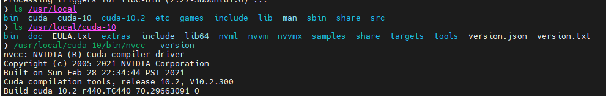
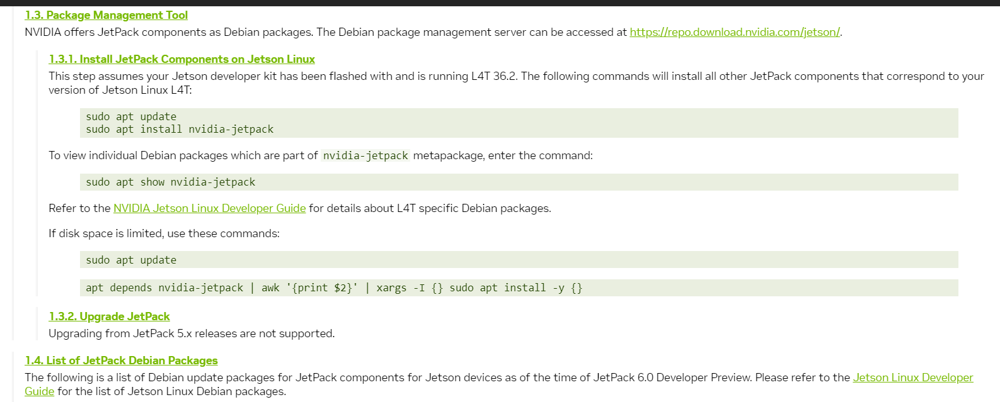

# Install libtorch on Nvidia jetson nano

## Step 1 verify whether JetPack installed

- change directory to ``/usr/local/`` and check whether ``cuda-10`` and ``cuda-10.2`` is available.

- change directory to ``/usr/local/cuda-10/bin``, and check the version of nvcc.

  

- if JetPack in not installed, follow the following [link](https://docs.nvidia.com/jetson/archives/jetpack-archived/jetpack-461/install-jetpack/index.html).

  

## Step 2 install pytorch

- In terminal, run the following commands:

  ``sudo apt-get -y update``

  ``sudo apt-get -y install python3-pip libopenblas-dev``

- In this [webpage](https://forums.developer.nvidia.com/t/installing-pytorch-on-jetson-nano/222007/4), download ``Python 3.6 - torch-1.10.0-cp36-cp36m-linux_aarch64.whl``. Or, by clicking this [link](https://nvidia.box.com/shared/static/fjtbno0vpo676a25cgvuqc1wty0fkkg6.whl).

## Step 3 Install pip

- Run the following command to install pip:

  ``python3 -m pip install --upgrade pip``

## Step 4 Install .whl

- in terminal, type the following commands to install ``.whl`` file.

  ``python3 -m pip install --no-cache torch-1.10.0-cp36-cp36m-linux_aarch64.whl``

## Step 5 Verify

- in terminal, type the following commands to verify installation.

  ``python3 -c 'import torch'``

    ``python3 -c 'import torch; print(torch.cuda.is_available())'``

    ``python3 -c 'import torch; print(torch.cuda.device_count(), torch.cuda.current_device())'``

    ``python3 -c 'import torch; print(torch.cuda.device_count(), torch.cuda.get_device_name(0))'``

## Step 6 Export pytorch lib
- use the following commnad:

    ``echo "export TORCH_PREFIX=$HOME/.local/lib/python3.6/site-packages/torch/share/cmake/Torch" >> ~/.zshrc``

## Reference links

- [https://discuss.pytorch.org/t/how-does-one-use-libtorch-c-with-the-arch64-build-of-pytorch-for-the-nvidia-jetson/140627/5](https://discuss.pytorch.org/t/how-does-one-use-libtorch-c-with-the-arch64-build-of-pytorch-for-the-nvidia-jetson/140627/5)